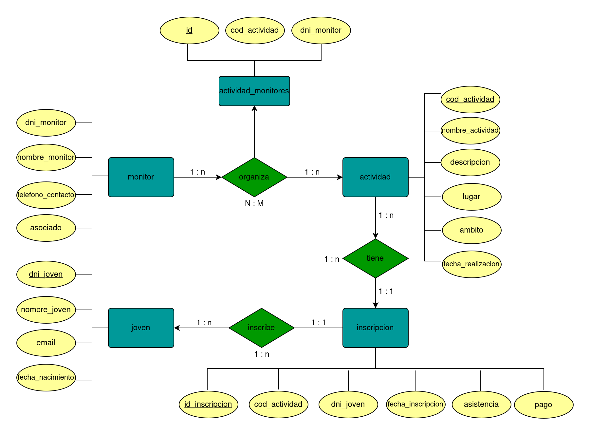

# Cuestionario

## Diferencia entre Base de Datos Relacional y SQL

Mientras que una Base de Datos Relacional es un tipo de base de datos que organiza la información en tablas, relacionadas entre sí por por campos o atributos (claves primarias o de origen, y claves externas o foráneas), SQL constituye el lenguaje de consulta para interactuar con bases de datos relacionales, a través de sus instrucciones o comandos.

## ¿Por qué es necesario para la tablas definir una primary key?

Principalmente porque:

- Asegura que cada registro de una tabla sea único.
- Permite identificar de forma inequívoca cada registro.
- Permite establecer relaciones entre tablas al vincularse con claves externas.
- Garantiza que los datos no se dupliquen, ni que sean nulos.
- Como consecuencia de lo anterior, puede suponer una mejora del rendimiento de la base de datos.

## ¿Cómo se denomina la relación que se hace entre una columna de un tabla y la primary key de otra tabla?

Clave foránea o externa (Foreign Key): Campo en una tabla vinculado a la clave primaria de otra tabla. Imprescindible para mantener la integridad de los datos y que sean consistentes a lo largo de la base de datos.

## ¿Qué es lo que necesitamos hacer para poder tener una relación n:m entre dos tablas?

Necesitamos crear una tabla intermedia, puesto que si no nos veríamos obligados a duplicar registros, siendo inválido e ineficiente. Las claves foráneas de la misma deben ser las claves primarias de cada una de las tablas principales. La clave primaria de esta tabla intermedia podrá constituirse como una clave compuesta de las claves foráneas, o utilizarse un campo adicional como identificador único.

# Consultas SQL sobre una base de datos

## Método 1

### Crear una base de datos nueva que se llame ProyectoFinal

psql -U postgres

CREATE DATABASE proyectofinal;

\c proyectofinal

### Copiar todas las sentencias definidas en el fichero sql y ejecutarlas

Realizado en la base de datos proyectofinal y con el cliente psql.

### Aseguraros que no os da ningún error y que se han creado las tablas con registros

proyectofinal=# \dt

## Consultas

### Buscar todos los clientes (customers) con el código postal 1010

SELECT company_name, postal_code FROM customers WHERE postal_code = '1010';

### Buscar el número de teléfono que tiene el proveedor (supplier) con id 11

SELECT supplier_id, company_name, phone FROM suppliers WHERE supplier_id = 11;

### Listar los primeros 10 pedidos (orders) ordenados de manera descendente por la fecha de pedido

SELECT order_id, order_date, customer_id, shipped_date FROM orders ORDER BY order_date DESC LIMIT 10;

### Buscar todos los clientes (customers) que vivan en London, Madrid o Brazil

SELECT company_name, city, country FROM customers WHERE city IN ('London', 'Madrid') OR country = 'Brazil';

### Añadir un nuevo registro en la tabla clientes (customers) con la siguiente información (indicada en el mismo orden de las columnas): “XYZ”, “The Shire”, “Bilbo Baggins”, “1 Hobbit-Hole", "Bag End", "111" y "Middle Earth"

INSERT INTO customers (
customer_id,
company_name,
contact_name,
address,
city,
region,
postal_code
)
VALUES (
'XYZ',
'The Shire',
'Bilbo Baggins',
'1 Hobbit-Hole',
'Bag End',
'Middle Earth',
'111'
);

### Actualizar el código postal a “11122” del cliente “Bilbo Baggins”

UPDATE customers SET postal_code = '11122' WHERE contact_name = 'Bilbo Baggins';

### Mostrar “ProductName” y “CategoryName” de todos los productos (products)

SELECT p.product_name, c.category_name
FROM products p
JOIN categories c ON p.category_id = c.category_id
ORDER BY p.product_name ASC;

### Mostrar “OrderID” y “CompanyName” del expedidor (shippers) de todos los pedidos (orders) realizados antes del 9 de agosto de 2012

SELECT o.order_id, s.company_name, o.order_date
FROM orders o
JOIN shippers s ON o.ship_via = s.shipper_id
WHERE o.order_date < '2012-08-09';

\*(resultado de la consulta, todos los pedidos puesto que el último se hizo el 06/05/1998)

### Mostrar el número de pedidos (orders) realizados por cada expedidor (shipper)

SELECT s.company_name, COUNT(o.order_id) AS number_of_orders
FROM orders o
JOIN shippers s ON o.ship_via = s.shipper_id
GROUP BY s.company_name;

# Modelado de Base de Datos

## Introducción

La asociación juvenil de nuestro ayuntamiento dirige varias ACTIVIDADES, trabaja para la integración e inserción social de jóvenes migrantes y en riesgo de exclusión social, así como entretener y educar en valores, deporte y cultura a todos los JÓVENES del municipio.
La asociación cuenta con varios acuerdos y convenios para realizar las actividades.
Tanto socios como voluntarios, actuán como MONITORES para organizar y dirigir las actividades.
Mediante INSCRIPCIONES se materializa el pago y la organización de los eventos.

## Requisitos y relaciones

Organiza: Relación entre Monitores y Actividades. Un monitor puede organizar varias actividades y una actividad puede ser organizada por varios monitores. Cardinalidad: N:M.

Tiene: Relación entre Actividades e Inscripciones. Una actividad puede tener varias inscripciones y una inscripción pertenece a una única actividad. Cardinalidad: 1:N.

Inscribe: Relación entre Jóvenes e Inscripciones. Un joven puede inscribirse en varias actividades (a través de varias inscripciones) y una inscripción pertenece a un único joven. Cardinalidad: 1:N.

Para la relación entre la entidad "monitor" y la entidad "actividad", se crea una tabla intermedia "actividad_monitores".

## Modelo entidad-relación

## Crear la base de datos con sus tablas y relaciones entre ellas

### Crear una base de datos nueva que se llame asociaciónjuvenil

psql -U postgres

CREATE DATABASE asociaciónjuvenil;

\c asociaciónjuvenil

### Crear tablas y relaciones

CREATE TABLE monitor (
dni_monitor VARCHAR(9) PRIMARY KEY,
nombre_monitor TEXT NOT NULL,
telefono_contacto VARCHAR(9),
asociado BOOLEAN NOT NULL
);

CREATE TABLE actividad (
cod_actividad SERIAL PRIMARY KEY,
nombre_actividad TEXT NOT NULL,
descripcion TEXT,
lugar TEXT,
ambito TEXT NOT NULL,
fecha_realizacion TIMESTAMP NOT NULL
);

CREATE TABLE actividad_monitores (
id SERIAL PRIMARY KEY,
cod_actividad INTEGER NOT NULL,
dni_monitor VARCHAR(9) NOT NULL,
CONSTRAINT fk_actividad FOREIGN KEY (cod_actividad) REFERENCES actividad(cod_actividad),
CONSTRAINT fk_monitor FOREIGN KEY (dni_monitor) REFERENCES monitor(dni_monitor)
);

CREATE TABLE joven (
dni_joven VARCHAR(9) PRIMARY KEY,
nombre_joven TEXT NOT NULL,
email VARCHAR(30),
fecha_nacimiento DATE NOT NULL
);

CREATE TABLE inscripcion (
id_inscripcion SERIAL PRIMARY KEY,
cod_actividad INTEGER NOT NULL,
dni_joven VARCHAR(9) NOT NULL,
fecha_inscripcion DATE DEFAULT CURRENT-DATE,
asistencia BOOLEAN NOT NULL,
pago BOOLEAN NOT NULL,
CONSTRAINT fk_actividad FOREIGN KEY (cod_actividad) REFERENCES actividad(cod_actividad),
CONSTRAINT fk_joven FOREIGN KEY (dni_joven) REFERENCES joven(dni_joven)
);

## Poblar la base datos con registros

INSERT INTO monitor (dni_monitor, nombre_monitor, telefono_contacto, asociado)
VALUES ('1234567Z', 'Ruben Perez', '648267568', 'yes'),
('4878962R', 'Ekaitz Irigoyen', '632432910', 'no'),
('3256223B', 'Marta San Roman', NULL, 'no'),
('4645343J', 'Roberto Matesanz', '655487113', 'yes'),
('8956555O', 'Saioa Ganuza', '677441126', 'yes'),
('7654891U', 'Ibai Goñi', NULL, 'no'),
('9468563I', 'Laura Salvador', '620284812', 'yes'),
('7652668Q', 'Romario Curaçao', '646668249', 'yes');

INSERT INTO actividad (nombre_actividad, descripcion, lugar, ambito, fecha_realizacion)
VALUES ('parkour', 'ejercicio de acrobacias en entorno urbano', 'Parque de Almanzor', 'deporte', '2024-02-04 17:30:00'),
('pintura', 'recreacion de cuadros historicos y nuevas creaciones', NULL, 'cultura', '2024-02-21 18:00:00'),
('repoblacion arborea', 'replantar arboles y vegetacion de zonas incendiadas', 'entorno Monte Ezkaba', 'medioambiente', '2024-02-28 16:00:00'),
('concurso televisivo', 'recrear concurso televisivo con preguntas a transehuntes del barrio', 'centro urbano', 'cultura', '2024-03-03 18:00:00'),
('olimpiada juvenil', 'serie de puebas deportivas con clasificaciones y premios', NULL, 'deporte', '2024-03-07 17:30:00'),
('conciertos', 'conciertos de grupos noveles de la zona', 'Pabellón Municipal María Cristina', 'cultura', '2024-03-16 17:30:00'),
('charlas IA', 'charlas divulgativas sobre el uso de la IA e impacto en nuestro día a día', 'Sala multiusos Casa de Cultura', 'educacion', '2024-04-02 18:00:00');

INSERT INTO actividad_monitores (cod_actividad, dni_monitor)
VALUES (1, '8956555O'),
(1, '7652668Q'),
(2, '9468563I'),
(3, '4878962R'),
(3, '4645343J'),
(4, '7654891U'),
(5, '1234567Z'),
(5, '4878962R'),
(5, '7652668Q'),
(6, '7654891U'),
(6, '8956555O'),
(7, '1234567Z');

INSERT INTO joven (dni_joven, nombre_joven, email, fecha_nacimiento)
VALUES ('74988116R', 'Lucas Miramon', 'lmiramon@gmail.com', '1997-04-28'),
('86772313K', 'Raquel Ostiz', NULL, '1998-01-13'),
('77999461L', 'Joseba Larrea', 'josefus99@gmail.com', '1999-09-09'),
('71211489G', 'Ohiane Garaikotxea', 'ogarai98@gmail.com', '1998-07-30'),
('98777331J', 'Enrique Barrena', NULL, '1999-08-02'),
('84512398F', 'Ane Manises', 'aneminguez@hotmail.com', '1997-12-03'),
('22345678P', 'Mikel Lujambio', NULL, '1998-05-11'),
('91827364A', 'Maite Garciarena', 'maitegarciarena@yahoo.es', '1999-02-28'),
('56473829S', 'Iker Munitis', 'ikermunitis@gmail.com', '1997-09-17'),
('19283746D', 'Nerea Remiro', NULL, '1998-11-06'),
('37465582L', 'Jon Sarasa', 'jonsarasa@hotmail.com', '1999-06-21'),
('65584937Z', 'Leire Palique', 'leirepalique@gmail.com', '1997-03-12');

INSERT INTO inscripcion (cod_actividad, dni_joven, fecha_inscripcion, asistencia, pago)
VALUES (1, '84512398F', '2023-12-05', 'yes', 'no'),
(1, '19283746D', '2023-11-08', 'yes', 'no'),
(1, '37465582L', '2023-12-03', 'no', 'no'),
(1, '65584937Z', '2023-11-30', 'yes', 'yes'),
(2, '86772313K', '2023-11-07', 'yes', 'yes'),
(2, '77999461L', '2023-12-03', 'no', 'yes'),
(2, '91827364A', '2023-12-15', 'yes', 'yes'),
(2, '19283746D', '2023-11-07', 'yes', 'no'),
(2, '65584937Z', '2023-11-01', 'no', 'no'),
(3, '98777331J', '2023-12-12', 'yes', 'yes'),
(3, '56473829S', '2023-11-30', 'yes', 'yes'),
(4, '74988116R', '2023-12-25', 'yes', 'yes'),
(4, '86772313K', '2023-12-04', 'yes', 'yes'),
(4, '56473829S', '2023-12-03', 'yes', 'no'),
(4, '19283746D', '2023-11-11', 'yes', 'yes'),
(4, '37465582L', '2023-12-01', 'yes', 'yes'),
(5, '77999461L', '2023-12-02', 'yes', 'no'),
(5, '71211489G', '2023-11-29', 'no', 'no'),
(5, '91827364A', '2023-11-11', 'yes', 'yes'),
(6, '86772313K', '2023-11-01', 'no', 'no'),
(6, '98777331J', '2023-11-16', 'yes', 'yes'),
(6, '84512398F', '2023-12-20', 'yes', 'yes'),
(6, '91827364A', '2023-12-08', 'no', 'yes'),
(6, '65584937Z', '2023-11-09', 'yes', 'no'),
(7, '71211489G', '2023-11-05', 'yes', 'yes'),
(7, '56473829S', '2023-12-18', 'yes', 'yes'),
(7, '19283746D', '2023-11-07', 'yes', 'yes'),
(7, '37465582L', '2023-12-01', 'yes', 'no');

## Consultas una vez completada la base de datos

¿Qué jóvenes tienen pendiente de proporcionar un email de contacto?

SELECT dni_joven, nombre_joven, fecha_nacimiento
FROM joven
WHERE email IS NULL;

¿Qué actividades de abril no pertenecen al ambito deportivo?

SELECT cod_actividad, nombre_actividad, descripcion, ambito, fecha_realizacion
FROM actividad
WHERE EXTRACT(MONTH FROM fecha_realizacion) = 4
AND ambito != 'deportivo';

¿Qué monitores tienen teléfono de contacto pero no figuran inscritos como asociados?

SELECT dni_monitor, nombre_monitor, telefono_contacto
FROM monitor
WHERE telefono_contacto IS NOT NULL 
AND asociado = false;

¿Cuántas actividades tiene asignadas cada monitor, incluidos los que no tienen ninguna asignada?
Ordenado de mayor a menor.

SELECT m.dni_monitor, 
       m.nombre_monitor, 
       COUNT(am.cod_actividad) as numero_actividades
FROM monitor m
LEFT JOIN actividad_monitores am ON m.dni_monitor = am.dni_monitor
GROUP BY m.dni_monitor, m.nombre_monitor
ORDER BY numero_actividades DESC;

¿Qué jóvenes no se han apuntado a ninguna actividad?

SELECT j.dni_joven, 
       j.nombre_joven, 
       j.email, 
       j.fecha_nacimiento
FROM joven j
LEFT JOIN inscripcion i ON j.dni_joven = i.dni_joven
WHERE i.id_inscripcion IS NULL;

¿Qué jóvenes han asistido a las actividades y siguen teniendo pendiente el pago de la misma?
Para saber también el nombre de la actividad, unimos también con la tabla actividad.

SELECT j.dni_joven, 
       j.nombre_joven, 
       j.email,
       i.cod_actividad,
       a.nombre_actividad,
       i.fecha_inscripcion       
FROM joven j
JOIN inscripcion i ON j.dni_joven = i.dni_joven
JOIN actividad a ON i.cod_actividad = a.cod_actividad
WHERE i.asistencia = true 
AND i.pago = false;